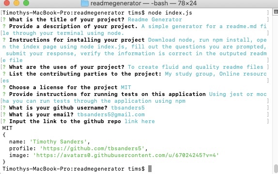

# **Readme Generator**
  

  
  ## View Program ##
  
  

  * [Video Walk-through](https://youtu.be/hoNczFXtBHc)

  ## Description ##

  A simple generator for a readme.md file through your terminal using node. Run the program, answer the prompt and the readme will write itself!

  ## Table Of Contents ##

  - [Description](#Description)
  - [Installation](#Installation)
  - [Usage](#Usage)
  - [Contributors](#Contributors)
  - [License](#License)
  - [Tests](#Tests)
  - [Repository](#Repository)
  - [Questions](#Questions)

  ## Installation ##

  1. Download node 
  1. Run npm install 
  1. Open the index page using node index.js 
 
  ## Usage ##

  1. Fill out the questions you are prompted 
  1. Submit your response 
  1. Verify the information is correct in the outputed readme file

  ## Contributors ##

  * [Nancy Lambert-Brown](https://github.com/n-lambert)
  * [Plover Brown](https://github.com/rebgrasshopper)
  * [Nicholas Konzen](https://github.com/NTKonzen)
  * [Talia Vazquez](https://github.com/taliavazquez)
  * [ShieldsIO](https://shields.io/category/license) 
  * [Nodejs.org](https://nodejs.org/en/)

  ## License ##

  https://api.github.com/licenses/mit

  ## Tests ##

  Using jest or mocha you can run tests through the application using npm test.

  ## Repository ##

  - [My Projects Repository](https://github.com/tbsanders5/readmegenerator)

  ## Questions ##

  
  - Timothy Sanders
  - [My Profile](https://github.com/tbsanders5)
  - tbsanders5@gmail.com

